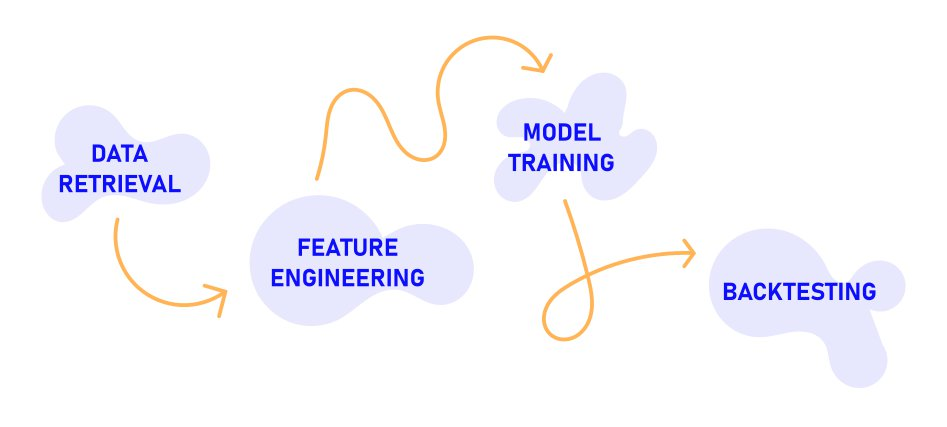

## TL;DR
Using SP500 data (2005-2025) we tried to calculate the Hurst exponential amongst other data to train a ML model (random forest) to see if we can find some alpha. We ran some feature importance and ablation tests to see what data was working for the model and after that we did some backtesting on non trained data (2025-today).



## 1. Data Retrieval (`data_pipeline.py`)

This part is where we fetch market data and transform it into a clean dataset ready for ML.

### Functions:

* **`fetch_data(ticker, start_date, end_date)`**
    Connects to the yahoo finance API (`yfinance`) to download daily OHLCV (Open, High, Low, Close, Volume) data. It does some data cleaning by stripping unnecessary columns, flattening pandas MultiIndexes (if present), and dropping initial missing values.

## 2. Data Engineering (`data_pipeline.py`)

Here, we transform the dataset to stationary data (features) so the ML model can train on it.

### Functions:

* **`calculate_hurst_rs(price_series)`**
    It implements Rescaled Range (R/S) analysis on a 1D array of prices by converting prices to logarithmic returns, dividing the series into non-overlapping chunks (lags), Calculating the cumulative deviation, Range (R), and Standard Deviation (S) for each chunk and performing a log-log linear regression (using `numpy.polyfit`) to extract the slope, which represents the Hurst exponent.

* **`calculate_all_features(df)`**
    This function calculates vectorized features: daily Log Returns, 20-day volatility, 10-day momentum, and relative volume (20 days). Also applies the `calculate_hurst_rs` function over a 60-day rolling window using `pandas.Series.rolling().apply()`. After this, it creates the `Target` variable for the ML model (shifting returns by -1 to predict if tomorrow's return will be positive or negative/flat). It also drops all initial `NaN` rows generated by the 60-day lookback period to ensure a clean feature matrix (`X`) and target vector (`y`).

## 3. Model Training (`model_training.py`)

In this module we take our clean feature matrix and we train a random forest classifier model on it. We validate it without looking into the future, and then we save the final model to disk.

### Functions:

* **`perform_walk_forward_validation(X, y, model, n_splits=5)`**
    Instead of a standard random train/test split, this uses `TimeSeriesSplit` to create expanding historical windows. It trains on the past and tests on the future (e.g., train on 2005-2010, test on 2011) to prevent data leakage and simulate a realistic trading environment. It returns the average accuracy across all folds.

* **`get_feature_importance(model, feature_names)`**
    Audits the random forest by extracting the feature weights. Basically, it ranks our inputs to see which ones the model relied on the most to make its predictions.

* **main**
    Inside the main execution block, it initializes the `RandomForestClassifier` (using 100 trees and capping `max_depth=5` to prevent overfitting on market noise). After running the baseline validation, it performs ablation studies (removing Hurst, then removing Momentum) to test how robust the model is when missing key information.

    Finally, it retrains the model one last time using all available Phase 1 data (2005-2025) so it has the maximum amount of experience, and saves it as `quant_random_forest.pkl` (via `joblib`) ready to be used in the backtesting module.

```console
1. Loading and preparing data from Phase 1 (2005 to 2024)...
Downloading data for SPY from 2005-01-01 to 2025-01-01...
Calculating fast basic features...
Calculating rolling Hurst Exponent (this might take 10-20 seconds)...

2. Initializing the Random Forest Model...

3. Running Walk-Forward Optimization (Full Model)...
Fold 1 | Train Size: 829 | Test Size: 829 | Accuracy: 0.5428
Fold 2 | Train Size: 1658 | Test Size: 829 | Accuracy: 0.5392
Fold 3 | Train Size: 2487 | Test Size: 829 | Accuracy: 0.5211
Fold 4 | Train Size: 3316 | Test Size: 829 | Accuracy: 0.5682
Fold 5 | Train Size: 4145 | Test Size: 829 | Accuracy: 0.5404
>>> Average Walk-Forward Accuracy: 0.5423


--- FEATURE IMPORTANCE ---
   Feature  Importance
 Hurst_60d    0.239551
   Mom_10d    0.203164
   Rel_Vol    0.202702
Log_Ret_1d    0.177791
   Vol_20d    0.176793

5a. Running Ablation Study A (Removing Hurst_60d)...
Fold 1 | Train Size: 829 | Test Size: 829 | Accuracy: 0.5404
Fold 2 | Train Size: 1658 | Test Size: 829 | Accuracy: 0.5513
Fold 3 | Train Size: 2487 | Test Size: 829 | Accuracy: 0.5283
Fold 4 | Train Size: 3316 | Test Size: 829 | Accuracy: 0.5730
Fold 5 | Train Size: 4145 | Test Size: 829 | Accuracy: 0.5380
>>> Average Walk-Forward Accuracy: 0.5462
>>> Impact of Hurst on Accuracy: -0.0039 (-0.39%)

5b. Running Ablation Study B (Removing Mom_10d, keeping Hurst)...
Fold 1 | Train Size: 829 | Test Size: 829 | Accuracy: 0.5368
Fold 2 | Train Size: 1658 | Test Size: 829 | Accuracy: 0.5561
Fold 3 | Train Size: 2487 | Test Size: 829 | Accuracy: 0.5103
Fold 4 | Train Size: 3316 | Test Size: 829 | Accuracy: 0.5706
Fold 5 | Train Size: 4145 | Test Size: 829 | Accuracy: 0.5392
>>> Average Walk-Forward Accuracy: 0.5426
>>> Impact of Momentum on Accuracy: -0.0002 (-0.02%)

6. Re-training the final model on ALL features before saving...
Model saved as 'quant_random_forest.pkl'. Ready for Backtesting!
```

## 4. Backtesting & Risk Evaluation (`backtesting.py`)

In the final stage we use the model trained in the previous step to trade out of sample data (unseen data from 2025). We simulate a real brokerage account by adding friction costs (0.05%) to see if found alpha.

### Function:

* **`run_backtest()`**
    It does four main tasks. First, it loads the saved `quant_random_forest.pkl` model, extracts the raw probabilities (`predict_proba`) and enforces a strict 55% confidence threshold (51% performs worse and 66% doesn't make any operations).

    Second, it calculates the ideal returns and then deducts a 0.05% friction cost (accounting for slippage and broker fees) every time the position changes. This prevents high-frequency looking profitable on paper.

    Third, it evaluates the quality of the returns by calculating sharpe ratio and max drawdown.

    And last, it uses `matplotlib` to render a chart, providing a visual comparison between our strategy (with and without fees) and the standard Buy & Hold SP500 benchmark.

```console
1. Loading the trained 'Brain'...
2. Fetching recent data for the Vault (Phase 2)...
Downloading data for SPY from 2024-06-01 to 2026-01-01...
Calculating fast basic features...
Calculating rolling Hurst Exponent (this might take 10-20 seconds)...
Loaded 250 days of unseen data for backtesting.

3. Generating predictions (Requiring 55.00000000000001% confidence)...

4. Simulating the Market (Ideal vs Realistic)...

5. Calculating cumulative equity curves (Base 1.0 = 100%)...
----------------------------------------
FINAL BACKTEST RESULTS (Out of Sample)
----------------------------------------
Buy & Hold SPY (Benchmark) : +18.01%
Strategy (Ideal/No Fees)   : +20.74%
Strategy (Realistic)       : +16.06%
----------------------------------------
Max Drawdown               : -13.96%
Sharpe Ratio               : 0.87
Total Trades Executed      : 79
Days in Cash               : 87 out of 249 days
----------------------------------------
```

## Conclusions

It was a fun experiment learning about Hurst's exponent and fractional brownian motion and how it is applied. The feature importance and ablation studies show contradicting results for Hurst, but it might be because of the high correlation with momentum.

Some other things to try are playing with temporal horizons of the features to see if we can improve the model, play with the confidence threshold or try other markets.

Even though the model (with fees) didn't outperform buy and hold, it spent 87 days in cash without risk, and getting a better sharpe than the index.
